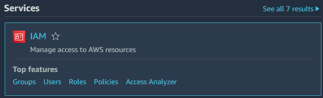
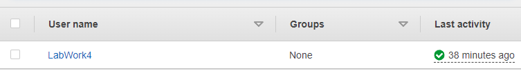
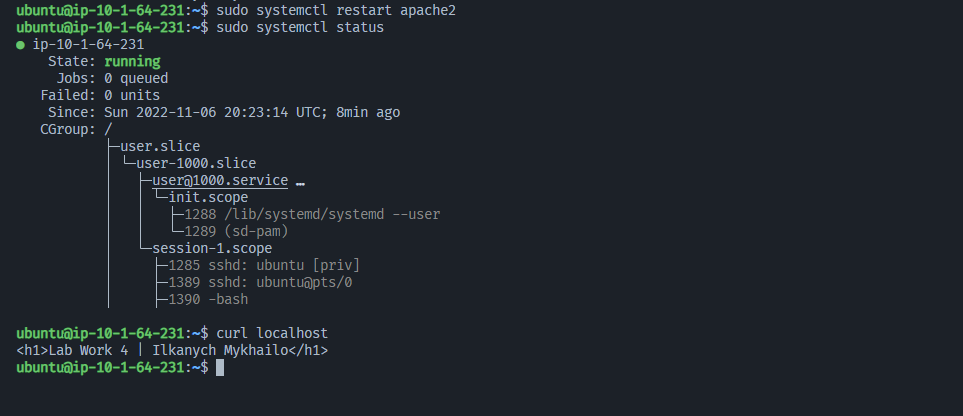
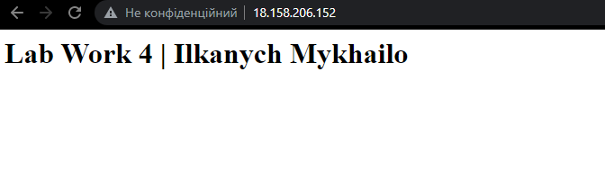

# Лабораторна робота №4. Створення сценарій terraform для надання інфраструктури в хмарі GCP (або AWS)

## Вимоги:

- Створіти один екземпляр (зображення: ubuntu 20.04)
- Дозволити трафік HTTP/HTTPS на мережевому адаптері
- Надати один відкритий ключ SSH для створеного екземпляра
- Встановіть веб-сервер (HTTP-сервер Apache / HTTP-сервер NGINX) за сценарієм bash

## Виконав: Ільканич Михайло Васильович. ІПЗ 1.2

---

## План:

- Створити аккаунт на AWS
- Засетапити навколишнє середовище

---

## Створити аккаунт та user'а

- Спочатку потрібно зареєструватись на AWS, та створити користувача в IAM
  
- Створивши юзера, можна почати сетапити середовище для
  

## Сетап навколишнього середовища

### Створення файлу `provider-main.tf` для налаштування Terraform і провайдера AWS:

```
terraform {
  required_providers {
    aws = {
      source  = "hashicorp/aws"
      version = "~> 3.0"
    }
  }
}
provider "aws" {
  access_key = "access_key"
  secret_key = "secret_key"
  region     = "eu-central-1"
}
```

### Потім потрібно створити файл `key-pair-main.tf`, з наступним кодом:

```# Generates a secure private key and encodes it as PEM
resource "tls_private_key" "key_pair" {
  algorithm = "RSA"
  rsa_bits  = 4096
}

# Create the Key Pair
resource "aws_key_pair" "key_pair" {
  key_name   = "${lower("labwork4")}-${lower("labwork4")}-linux-${lower("eu-central-1")}"
  public_key = tls_private_key.key_pair.public_key_openssh
}

# Save file
resource "local_file" "ssh_key" {
  filename = "${aws_key_pair.key_pair.key_name}.pem"
  content  = tls_private_key.key_pair.private_key_pem
}
```

---

## Створення мережевих файлів Terraform

### Створив `network-main.tf` для створення VPC, публічної підмережі, інтернет-шлюзу та необхідні маршрути.

```
resource "aws_vpc" "vpc" {
  cidr_block           = var."10.1.64.0/18"
  enable_dns_hostnames = true
}

resource "aws_subnet" "public-subnet" {
  vpc_id            = aws_vpc.vpc.id
  cidr_block        = var."10.1.64.0/24"
  availability_zone = var."eu-central-1a"
}

resource "aws_internet_gateway" "gw" {
  vpc_id = aws_vpc.vpc.id
}

resource "aws_route_table" "public-rt" {
  vpc_id = aws_vpc.vpc.id
  route {
    cidr_block = "0.0.0.0/0"
    gateway_id = aws_internet_gateway.gw.id
  }
}

resource "aws_route_table_association" "public-rt-association" {
  subnet_id      = aws_subnet.public-subnet.id
  route_table_id = aws_route_table.public-rt.id
}
```

---

## Створення файлів для змінних Ubuntu

### Створив файлик `ubuntu-version.tf`, який буде зберігати змінні для версій `Linux`. В values вказав `20.04` версію Ubuntu.

```
data "aws_ami" "ubuntu-linux-2004" {
  most_recent = true
  owners      = ["099720109477"] # Canonical
  filter {
    name   = "name"
    values = ["ubuntu/images/hvm-ssd/ubuntu-focal-20.04-amd64-server-*"]
  }
  filter {
    name   = "virtualization-type"
    values = ["hvm"]
  }
}
```

---

### Створив `linux-variables.tf` та `linux-vm-main.tf`

`linux-variables.tf` - це файл в якому зберігаються настройки для Linux, які я буду використовувати в `linux-vm-main.tf`.

```
variable "linux_instance_type" {
  type        = string
  description = "EC2 instance type for Linux Server"
  default     = "t2.micro"
}
variable "linux_associate_public_ip_address" {
  type        = bool
  description = "Associate a public IP address to the EC2 instance"
  default     = true
}
variable "linux_root_volume_size" {
  type        = number
  description = "Volumen size of root volumen of Linux Server"
  default = 10
}
variable "linux_data_volume_size" {
  type        = number
  description = "Volumen size of data volumen of Linux Server"
  default = 20
}
variable "linux_root_volume_type" {
  type        = string
  description = "Volumen type of root volumen of Linux Server."
  default     = "gp2"
}
variable "linux_data_volume_type" {
  type        = string
  description = "Volumen type of data volumen of Linux Server"
  default     = "gp2"
}
```

---

Файл `linux-vm-main.tf`для створення екземпляра EC2. Цей розділ коду створить групу безпеки, яка дозволяє вхідні з’єднання SSH і HTTP.
Також створюю еластичний IP (EIP) і приєдную його до примірника Linux EC2. `ami = data.aws_ami.ubuntu-linux-2004.id` -- Тут обновляю Linux до потрібної мені версії.

```
resource "aws_eip" "linux-eip" {
  vpc  = true
  tags = {
    Name        = "${lower("labwork4")}-${"labwork4"}-linux-eip"
    Environment = "labwork4"
  }
}
# Create EC2 Instance
resource "aws_instance" "linux-server" {
  ami                         = data.aws_ami.ubuntu-linux-2004.id
  instance_type               = var.linux_instance_type
  subnet_id                   = aws_subnet.public-subnet.id
  vpc_security_group_ids      = [aws_security_group.aws-linux-sg.id]
  associate_public_ip_address = var.linux_associate_public_ip_address
  source_dest_check           = false
  key_name                    = aws_key_pair.key_pair.key_name
  user_data                   = file("aws-user-data.sh")
  # root disk
  root_block_device {
    volume_size           = var.linux_root_volume_size
    volume_type           = var.linux_root_volume_type
    delete_on_termination = true
    encrypted             = true
  }
  # extra disk
  ebs_block_device {
    device_name           = "/dev/xvda"
    volume_size           = var.linux_data_volume_size
    volume_type           = var.linux_data_volume_type
    encrypted             = true
    delete_on_termination = true
  }
  tags = {
    Name        = "${lower("labwork4")}-${"labwork4"}-linux-server"
    Environment = "labwork4"
  }
}

resource "aws_eip_association" "linux-eip-association" {
  instance_id   = aws_instance.linux-server.id
  allocation_id = aws_eip.linux-eip.id
}

resource "aws_security_group" "aws-linux-sg" {
  name        = "${lower("labwork4")}-${"labwork4"}-linux-sg"
  description = "Allow incoming HTTP connections"
  vpc_id      = aws_vpc.vpc.id
  ingress {
    from_port        = 443
    to_port          = 443
    protocol         = "tcp"
    cidr_blocks      = ["0.0.0.0/0"]
    description = "Allow incoming HTTPS connections"
  }
    ingress {
    from_port   = 80
    to_port     = 80
    protocol    = "tcp"
    cidr_blocks = ["0.0.0.0/0"]
    description = "Allow incoming HTTP connections"
  }
  ingress {
    from_port   = 22
    to_port     = 22
    protocol    = "tcp"
    cidr_blocks = ["0.0.0.0/0"]
    description = "Allow incoming SSH connections"
  }
  egress {
    from_port   = 0
    to_port     = 0
    protocol    = "-1"
    cidr_blocks = ["0.0.0.0/0"]
  }
  tags = {
    Name        = "${lower("labwork4")}-${"labwork4"}-linux-sg"
    Environment = "labwork4"
  }
}
```

---

## Створення файлу `terraform.tfstate`

### Загалом цей файл для підтвердження достовірність даних.

```
Дуже багато коду,подивіться в файлах вище
```

---

### Потім потрібно прописати `terraform init` та `terraform apply`

### За допомогою `ssh -i "name..."` ми підключаємось до Linux'a за ключем

### В Лінуксі ми прописуємо сценарій Bash, щоб встановити Apache Tomcat, та створюємо просту веб-сторінку

```
sudo apt-get update
sudo apt-get install -y apache2
sudo systemctl start apache2
sudo systemctl enable apache2
echo "<h1>Lab Work 4 | Ilkanych Mykhailo</h1>" | sudo tee /var/www html/index.html
```



## Все працює

## 

---

# Висновок: Лабораторна робота дуже крута та корисна,дякую!
