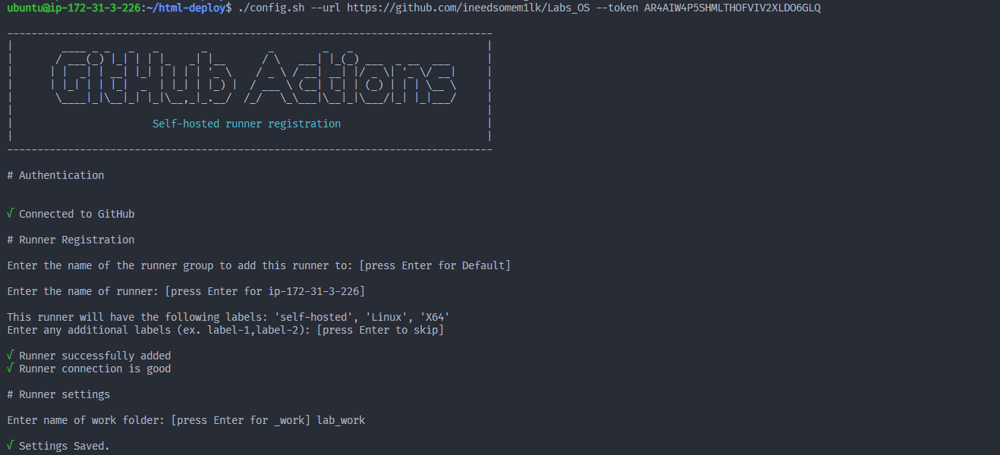

# Лабораторна робота №6. Використання GitHub Actions.

# План:

- ## Ознайомитись із поняттями CI/CD та GitHub Actions.
- ## Задеплоїти проект на EC2 або VPS(за наявності) за допомогою GitHub Actions.
- ## Ознайомитись із github pipelines та використати їх для реалізації CI/CD.

---

# Виконав: Ільканич Михайло Васильович

---

# 
Хід роботи: 

# 1 ) Ознайомитись із поняттями CI/CD та GitHub Actions.

- `CI/CD — це метод частої доставки додатків клієнтам шляхом впровадження автоматизації на етапах розробки додатків. Основні концепції CI/CD — безперервна інтеграція, безперервна доставка та безперервне розгортання. CI/CD — це рішення проблем, які інтеграція нового коду може спричинити для команд розробки та операцій (відомих також як «інтеграційне пекло»).`

- ` Зокрема, CI/CD запроваджує постійну автоматизацію та постійний моніторинг протягом життєвого циклу додатків, від етапів інтеграції та тестування до доставки та розгортання. У сукупності ці підключені практики часто називають «конвеєром CI/CD» і підтримуються командами розробки та операцій, які працюють разом у гнучкий спосіб за допомогою підходу DevOps або розробки надійності сайту (SRE).`

---

- ` GitHub Actions — це платформа безперервної інтеграції та безперервної доставки (CI/CD), яка дозволяє вам автоматизувати збірку, тестування та розгортання. Ви можете створювати робочі процеси, які створюють і тестують кожен запит на отримання до вашого сховища або розгортають об’єднані запити на отримання в робочому середовищі.`

---

# 2) Задеплоїти проект на EC2 або VPS(за наявності) за допомогою GitHub Actions.

- ` Для початку нам потрібно свторити інстанс на AWSi, як створювати інстанс надіюсь ви знаєте:)`
  
- `Надаємо в властивостях повний доступ, та конектимось до нього за допомогою ssh ключа,який ми можемо знайти на AWSi`
  
- ` Зайшовши в ОС інстанса,ми слідуємо гайду,який нам дає GitHub`
  
- `Вводжу ці команди,змінивши назву дерикторії`
  
- `Створюємо раннер на інстансі та запускаємо його `
  

---

- `Обновлюємо apt-get та встановлюємо nginx`
  
- `Шукаємо дерикторію з нашим раннером`
  
- `Переходимо до папки з nginx`
  
- `Видаляємо файл default, та створюємо його по новій, щоб ручками не видаляти зміст файлу`
  
- `Перезапускаємо nginx, та надоємо chmod нашим папкам`
  
- `Це працює!`
  

---

# 3) Ознайомитись із github pipelines та використати їх для реалізації CI/CD.

- `Переходимо на репозиторій, заходимо в вкладку actions, та створюємо workflow`
  
- `Вибираємо конфігурацію нашого workflow`
  
- `В цій вкладці ми пишемо назву нашої гілки, та ставимо self-hosted в runs-on`
  
- `Загалом виглядати конфіг може так:`
  
- `Дивимось чи працює, якщо ставить галочку при комітах то відповідно працює:)`
  
- `Можна також подивитись детальну інформацію`
  

---

# Висновок: Лабораторна робота дуже крута та корисна, дякую!
