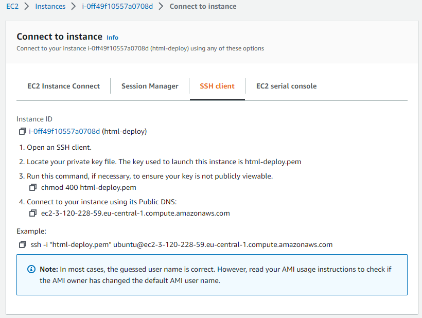

# Лабораторна робота №5. Деплой проекту на AWS EC2.

## План:

- ### Зареєструватись на AWS.
- ### Створити інстанс EC2.
- ### Задеплоїти проект (може бути html сторінка) і скинути посилання в звіт для можливості перегляду.

---

## Виконав: Ільканич Михайло Васильович

---

<h1 align="center">Хід роботи</h1>

## Зареєструватись на AWS.

- Спочатку нам потрібно перейти на сайт AWS, зареєструватись.
- Потім в пошуку знайти EC2, та вибрати його.
  

## Створити інстанс EC2.

- Вводимо назву сервера
  
- Вибираємо операційну систему
  
- Вибираємо тип інстансу
  
- Генеруємо ключ
  
- Додаємо налаштування мережі
  
- Також за бажанням додати додаткові налаштування
  
- Переходимо в вкладку instances  
  
- Вибираємо connect
  
- Туть вибираємо SSH client, та копіюємо ключ який вказаний в `Example:`
  
- В безпеці надаємо ключу повний доступ(як робили в лаб№4)

## Задеплоїти проект (може бути html сторінка) і скинути посилання в звіт для можливості перегляду.

- Ввійшовши в термінал нашої ос(яку ми вибирали вище), можемо інсталювати сервер щоб захостити
  
- Вище я забув заапдейтити apt (враховується доброю звичкою)
  
- Створюємо директорію з нашим доменом
  
- Відкриваємо наш index.html для редагування
  
- Заповнюємо нашу сторінку контентом
  
- Відкриваємо ще один файл за допомогою команди:
  
- Редагуємо файл відповідно ставлячи наш домен
  
- Також редагуємо конфіг сервера(nginx)
  
- Запускаємо наш сервер
  

# Все працює

## 

# Висновок: Лабораторна робота дуже крута та корисна, дякую!
