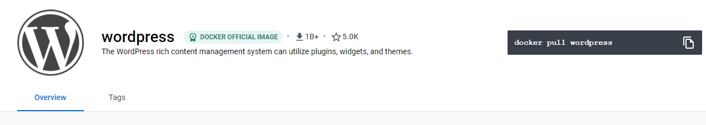
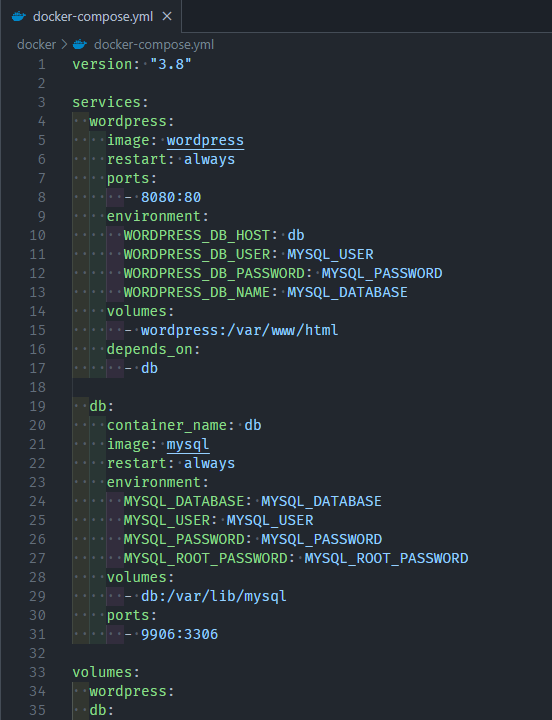
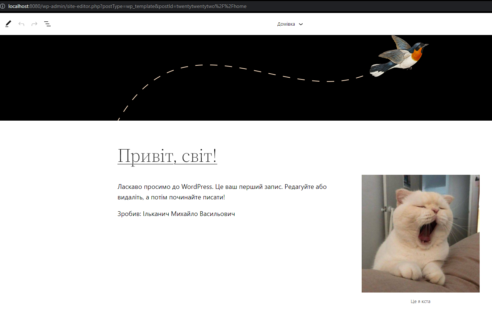
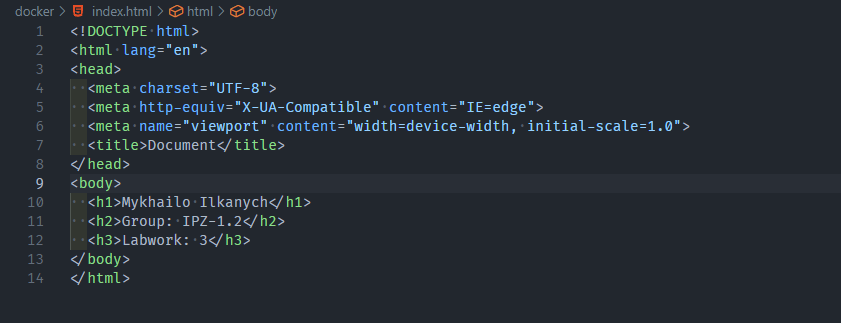
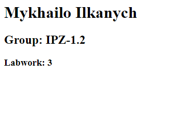
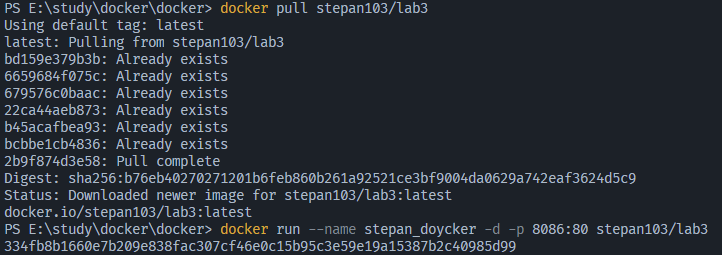
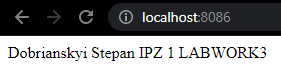

# Лабораторна робота №3. Docker

## План:

- Використання готових Docker Images.
- Використання Docker Compose.
- Створення HTML сторінки та занесення її в Docker Image.
- Залити даний Docker Image на Docker Hub.
- Скачати Docker Image когось із групи і розвернути в себе контейнер з HTML сторінкою на порті 8086 ззовні.

## Виконав: Ільканич Михайло Васильович. Група ІПЗ 1.2

---

### 1. Використання готових Docker Images.

    Ознайомитись із готовими Docker Images які знаходяться на Docker Hub. Використати образ wordpress та розвернути сайт із безкоштовною темою.

Зпулив Docker Image wordpress'а за допомогою команди <strong>docker pull wordpress</strong>, яка в казана на їх репозиторії в Docker Hub

На сайті також показано приклад для yml файла, його код за приклад я

```
version: '3.1'

services:

wordpress:
   image: wordpress
   restart: always
   ports:
      - 8080:80
   environment:
      WORDPRESS_DB_HOST: db
      WORDPRESS_DB_USER: exampleuser
      WORDPRESS_DB_PASSWORD: examplepass
      WORDPRESS_DB_NAME: exampledb
   volumes:
      - wordpress:/var/www/html

db:
   image: mysql:5.7
   restart: always
   environment:
      MYSQL_DATABASE: exampledb
      MYSQL_USER: exampleuser
      MYSQL_PASSWORD: examplepass
      MYSQL_RANDOM_ROOT_PASSWORD: '1'
   volumes:
      - db:/var/lib/mysql

volumes:
wordpress:
db:
```

взяв для свого `docker-compose.yml ` просто змінивши версію на "3.8"
в цьому файлі описується загальні сервіси імейджа. Такі як який імейдж використовується,порт, база даних.

Так виглядає сайт на wordpress, якщо перейти на
<strong>localhost:8080</strong>


---

## 2. Використання Docker Compose.

Описати теоретично що таке Docker Compose, чому саме розширення .yml а також навести переваги та недоліки його використання. Навести приклад створення та збирання образа за допомогою Docker Compose.

### 1) Описати теоритично що таке Docker Compose: <br>

- За допомогою Compose ви використовуєте файл YAML для налаштування служб програми. Потім за допомогою однієї команди ви створюєте та запускаєте всі служби з вашої конфігурації.

### 2) Чому саме розширення .yml ?

- YAML — це мова серіалізації даних, яка часто використовується для написання конфігураційних файлів. YAML є популярною мовою програмування, оскільки її легко читати та легко зрозуміти. Його також можна використовувати в поєднанні з іншими мовами програмування. Завдяки своїй гнучкості та доступності YAML використовується інструментом автоматизації Ansible для створення процесів автоматизації у формі Ansible Playbooks.

### 3.1) <strong>Переваги .yml</strong>

- У YAML не використовується додатковий роздільник. Тому він легший, ніж XML і JSON.
- YAML, без використання розділювача також робить читання легким і простим. (Я не впевнений, чи погоджуєтеся ви з цією думкою. Тому що багатьом фанатам легше читати дані за допомогою розділювача вмісту або тегів, які їх розділяють.) YAML полегшує розуміння даних. Тому це корисно у випадку конфігурації.
- Багато проблем із безпекою в мовах програмування пов’язані з аналізом ненадійного введення (наприклад, JSON). Python, Ruby, Java, JavaScript, PHP тощо дозволяють зловмисникам використовувати ці вразливості, обходячи неочікувані вхідні рядки для аналізатора. YAML розроблено для запобігання таким типам експлойтів, вказуючи, з якого типу даних має складатися кожна частина потоку YAML.

### 3.2) <strong>Недоліки .yml</strong>

- Існує так багато програм, які вже створено з використанням XML або JSON, тому розробнику важко замінити це YAML.
- Якщо говорити про популярність, XML має набагато більш зрілу екосистему, ніж YAML. JSON [JavaScript Object Notation] існує з початку 2000-х років, і багато хто його сприймає порівняно з YAML. Тому легше знайти підтримку JSON замість YAML.
- Існують додаткові застереження під час написання коду YAML. Навіть якщо ви не зберете один пробіл під час відступу, ваш код може перестати працювати.
- Існує багато способів представлення даних у YAML та створення ієрархії даних. Тому він складний для обробки. Тому JSON і XML мають кращу продуктивність, ніж YAML.

### 4) Навести приклад створення та збирання образа за допомогою Docker Compose.

- Створивши файлик docker-compose.yml, та написавши конфігурацію можна запустити імейдж за допомогою команди <strong>docker compose up</strong>.

---

## 3. Створення HTML сторінки та занесення її в Docker Image.

- Створити HTML сторінку із вашим ПІБ, групою та № Л.Р..
- Створити Docker Image із цією сторінкою.
- Реалізувати можливість запуску цієї сторінки з контейнера (потрібно sudo usermod -aG docker username сервер NGINX до прикладу).
- Перевірити на працездатність контейнера на основі вашого образу.
- Залити готовий образ на Docker Hub.

### 3) Залити даний Docker Image на Docker Hub.

- Створив HTML сторінку з своїм ПІБ, групою та номером Лабораторної роботи.<br>

- Створив та реалізував контейнер коли заранив dockerfile. <br>
  

- Перевірив на працездатність: <br>

  

- Залив на image на [DockerHub:](https://hub.docker.com/repository/docker/ineedsomem1lk/labwork3)

---

## 4. Скачати Docker Image когось із групи і розвернути в себе контейнер з HTML сторінкою на порті 8086 ззовні.

- Я скачав контейнер Степана Добрянського з ІПЗ 1.1 ([DockerHub.](https://hub.docker.com/repository/docker/stepan103/lab3))
- Розвернув його <br>
  
- Запустив на порті 8086 <br>
  

---

## Висновки: Лабораторна робота дуже крута та корисна,дякую!
