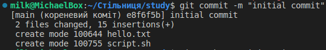

# ЛАБОРАТОРНА РОБОТА № 2
# Виконав Ільканич Михайло Васильович. 
# ІПЗ 1.2
# Тема: Основні команди системи контролю версій Git

1. Пройти гру Git Learn та зробити скріншоти пройдених рівнів.
    * Перша гілка основи:
    * 
    * Друга гілка Віддалені репозиторії
    * 

2. Зробити git init папки із файлом hello.txt та bash скринптом.
   * 
3. Скріншот з git init.
   * 

4. Зробити git push у віддалений репозиторій у вітку lab_works_one_two.

   * 

5. Додати в папку Readme файл із звітом до лабораторної, щоб його можна було передивлятись на репозиторію коли переходиш у вітку.
   